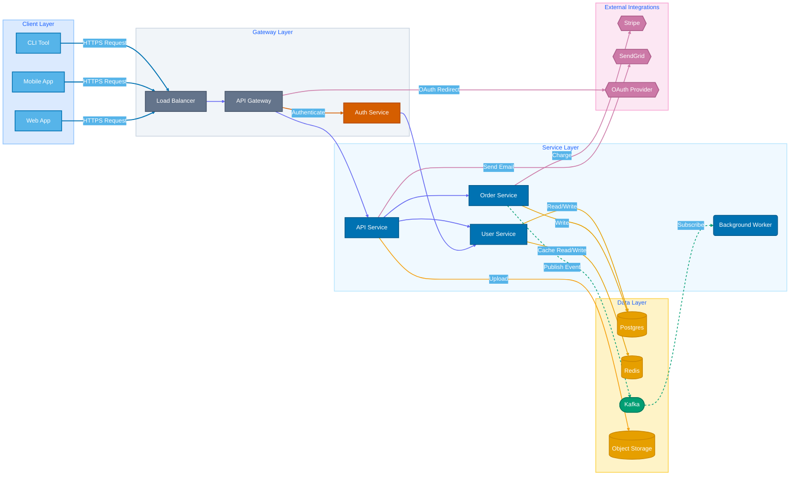

# Current Scenario:

[[_TOC_]]

*Generated on 2/18/2026*

---

## Epic Status

## Objective

Integrate Broadridge Cash Management files into the Data Mesh by extending the existing Azure ingestion pipeline and adding a new Axway connector that pulls files into the Azure ingestion container’s datafiles/ and Controlfile directory. Keep the control-file-driven trigger, SHA256 validation, CSV/TXT/PARQUET parsing, and Parquet outputs. Decision: reuse and extend the current pipeline to minimize rework and preserve validation; tradeoff is faster integration and lower duplication versus increased coupling and added connector error‑handling complexity.

## Context & Motivation

The goal is to onboard Broadridge Cash Management files into the organization’s Data Mesh by extending the existing Azure ingestion pipeline and adding an Axway connector. Decision: reuse the current control-file-driven ingestion flow rather than rearchitecting the pipeline. The Axway connector will pull files and deposit data files into the Azure ingestion container’s datafiles/ path and place matching single-record control files into the Controlfile directory to trigger ingestion.

Why this approach:
- Leverages the existing pipeline’s validation (SHA256), parsing (csv/txt/parquet), and Parquet output logic, minimizing changes and development risk.
- Keeps the ingestion trigger model (control file arrival) intact, preserving downstream expectations and tooling.

Tradeoffs and risks:
- Connector responsibility increases: it must guarantee atomic placement of data + control files, conform to the existing control-file schema (Count, Business Date, Checksum, etc.), and handle partial transfers; otherwise pipeline runs may fail or require retries.
- Any Axway-specific metadata mapping or format normalization must be implemented in the connector, adding scope to the connector work rather than the pipeline.
- Operational dependency moves to the connector for latency and reliability; monitoring and retry strategies for the connector must be defined (not in scope here).

Relevant issues/epics: no issue or epic links were provided; please attach BR-Axway-Connector and BR-Pipeline-Enhancement epics if available.

## Goals & Non-Goals

Goals:
- Implement an Axway connector that pulls Broadridge Cash Management files into the existing Azure Ingestion Container, placing files into datafiles/ and Controlfile directories. Decision: reuse the current control-file-triggered ingestion pipeline to minimize scope and risk; tradeoff: changes limited to connector and delivery path, not pipeline logic.
- Preserve existing control-file schema, SHA256 validation, parsing (csv/txt/parquet) and Parquet outputs for downstream compatibility.

Non-Goals:
- Not redesigning the ingestion pipeline or replacing SHA256 validation.
- Not changing control-file schema or Azure storage layout.
- Not adding new file formats beyond csv/txt/parquet.
- Not negotiating external SLAs with Broadridge or introducing new SLOs/SLIs or downstream transformations within this scope.

## Proposed Design

Overview
- Deliver a lightweight Axway connector that deposits Broadridge Cash Management data files and accompanying Control Files into the existing Azure ingestion container (datafiles/ and Controlfile directory). The existing ingestion pipeline remains unchanged and continues to perform SHA256 validation, parsing (csv/txt/parquet) and Parquet output writes. The connector is responsible only for reliably transferring files from Axway into the container in a manner that preserves the pipeline’s trigger semantics.

Connector placement and runtime
- Implement the connector as an Azure-hosted component (container or Function App) that runs scheduled, idempotent pulls from Axway. Decision: an Azure-hosted pull process minimizes changes to the existing pipeline and centralizes network credentials and monitoring in the same cloud tenancy. Tradeoff: polling introduces small latency versus a push model; chosen because Axway push integration details are not in scope and polling is robust across Axway configurations.

File transfer and atomic placement
- Data files are downloaded to a transient staging location (local temp or staging blob path). After successful download and local checksum verification (SHA256 computed by connector), the connector uploads the data file into datafiles/ using a temporary filename and then performs an atomic rename/commit (move) to the final datafiles/ path. The Control File is uploaded to the Controlfile directory only after the data file is in its final location and verified. Decision: writing the data first and then placing the Control File preserves the pipeline’s trigger semantics; atomic moves avoid partially visible files. Tradeoff: requires careful ordering and storage operations; Azure Blob does not support server-side rename so the connector must perform copy-then-delete (acceptable operational cost).

Control File handling and idempotency
- The connector will produce Control Files that match the existing single-record metadata schema (Count, Business Date, Checksum, unique FileID). The connector will populate the checksum field with the SHA256 computed locally. In order to prevent duplicate ingestion, the connector will include a unique FileID and filename pattern aligned with existing pipeline expectations. The pipeline’s existing SHA256 validation remains the authoritative SLI for file integrity. Decision: maintain existing control-file schema to avoid pipeline changes. Tradeoff: connector must ensure schema fidelity exactly; any mismatch will surface as pipeline validation failure.

Error handling and failure modes
- On download or upload errors, the connector will (a) place the source file in an Axway retry/hold in Axway (if supported) or (b) leave it for subsequent polling, and (c) log and surface a failure record in a designated blob path (ingestion_errors/) including reasons and original Axway identifiers. If checksum verification fails, the connector will not publish the Control File and will mark the file as quarantined. Decision: avoid publishing Control Files when integrity is suspect to prevent pipeline execution on bad data. Tradeoff: manual intervention may be required for quarantined files.

Concurrency and scaling
- Connector instances will coordinate using blob-lease or an Azure storage-based lock to ensure only one instance pulls a given Axway transfer batch. Decision: simple lease-based locking is sufficient given per-source file volumes and avoids introducing additional infrastructure. Tradeoff: lease conflicts can delay processing; acceptable given expected throughput.

Minimal changes to existing pipeline
- No changes to the pipeline’s validation, parsing, or output logic are required. The connector’s responsibility is to faithfully produce files and matching Control Files in the exact container paths and naming conventions the pipeline expects. Decision: reduce risk by keeping pipeline unchanged. Tradeoff: any existing pipeline assumptions about control-file timing must be observed by connector implementation.

Operational notes (implementation constraints)
- Connector must log Axway transfer IDs alongside blob paths for traceability. It must populate checksum exactly as used by the pipeline (SHA256). Any enhancements to control-file schema or trigger behavior are out of scope.

## Architecture Diagram

## User Stories

**US-001: Implement Azure-hosted Connector Container Skeleton** [3pt] 🟠
> As a platform engineer, I want I want to create a containerized connector skeleton with configurable scheduling, so that the connector can run in Azure as a scheduled pull process., so that Enable scheduled, Azure-hosted runs with a configurable polling interval (default 5 minutes) to minimize integration friction..

Acceptance Criteria:
- [ ] Connector runs as a Docker image and starts without error in a local container environment
- [ ] Configurable polling interval is supported via environment variable; when set to 5 minutes the process initiates a poll within ±30 seconds of each 5-minute boundary in an integration test
- [ ] Container exposes /health and /ready endpoints returning HTTP 200 within 1s when dependencies are reachable
- [ ] Dockerfile and container image are present in repository and can be built locally with a single make/build command

**US-002: Implement Axway Poll-and-Download Logic** [3pt] 🟠
> As a backend developer, I want I want to implement scheduled polling of Axway and download transfers to a transient staging location, so that data files are reliably retrieved for processing., so that Ensure connector can fetch files from Axway and place them in transient staging for downstream verification, reducing missed transfers..

Acceptance Criteria:
- [ ] Connector successfully lists available Axway transfers using configured credentials and logs transfer IDs
- [ ] Connector downloads a sample transfer to a local transient staging path and the downloaded file size matches Axway-reported size
- [ ] Downloaded files are written to a configurable transient path and a manifest entry (transfer ID, local path, timestamp) is recorded in logs

**US-003: Compute and Verify Local SHA256 Checksum** [2pt] 🟠
> As a backend developer, I want I want to compute SHA256 for downloaded files and validate integrity, so that only verified files proceed to upload and the pipeline's SHA256 check will pass., so that Prevent publishing control files for corrupted downloads; ensure connector-provided checksum matches pipeline validation..

Acceptance Criteria:
- [ ] Connector computes SHA256 of any downloaded file and stores the value in the local manifest
- [ ] If computed SHA256 matches an optional Axway-provided checksum or expected value, the file is marked verified and eligible for upload
- [ ] If SHA256 verification fails, the file is moved to a configurable quarantine location and no Control File is uploaded; a quarantine record is written to ingestion_errors/ including transfer ID and checksum mismatch reason

**US-004: Upload Data Files With Atomic Commit** [3pt] 🟠
> As a platform engineer, I want I want to upload verified data files to datafiles/ using a temporary name and then atomically commit via copy-then-delete, so that downstream pipeline sees only fully uploaded files., so that Avoid partially visible blobs in datafiles/ and ensure pipeline trigger semantics are preserved..

Acceptance Criteria:
- [ ] Verified data file is uploaded to blob container under datafiles/ with a temporary filename (e.g., .tmp suffix)
- [ ] Connector performs copy-then-delete to create the final filename in datafiles/ and deletes the temporary object; after operation only final filename exists
- [ ] Final blob has the same SHA256 as the locally computed checksum and the temporary blob is removed within 60 seconds of successful commit

**US-005: Generate and Publish Control File Post-commit** [2pt] 🟠
> As a backend developer, I want I want to generate a single-record Control File matching the existing schema and upload it to Controlfile directory only after data commit, so that the existing ingestion pipeline is triggered correctly., so that Maintain pipeline compatibility and avoid false triggers; ensure control file contains accurate metadata (Checksum, Count, BusinessDate, FileID)..

Acceptance Criteria:
- [ ] Control File is uploaded to Controlfile/ only after the corresponding data file final blob exists and its checksum is verified
- [ ] Control File contains fields Count, Business Date, Checksum, and unique FileID; a JSON or CSV schema validation script returns valid for the generated control file
- [ ] Checksum value in the Control File equals the locally computed SHA256 and pipeline mock validation accepts the Control File

**US-006: Implement Blob-lease Based Concurrency Locking** [2pt] 🟠
> As a platform engineer, I want I want to coordinate multiple connector instances using blob-lease locks, so that only one instance processes a given Axway transfer batch at a time., so that Prevent duplicate downloads/uploads and race conditions when multiple connector instances are running..

Acceptance Criteria:
- [ ] Connector acquires an Azure blob lease for a transfer batch before processing and releases it after completion
- [ ] When a second connector instance attempts to process the same transfer while lease is held, it skips processing and logs 'lease held' with the lease owner ID
- [ ] Integration test demonstrates only one instance processes the same transfer ID when two instances start concurrently

**US-007: Log Errors To ingestion_errors Blob Path** [2pt] 🟠
> As a backend developer, I want I want to write structured error records to ingestion_errors/ with Axway IDs and failure reasons, so that failures are traceable and can be investigated., so that Provide operational visibility: every download/upload/checksum failure is recorded with transfer ID and error details for troubleshooting..

Acceptance Criteria:
- [ ] On any download, checksum, or upload failure a JSON error record is written to ingestion_errors/ with fields: transferID, timestamp, operation, errorCode, errorMessage, and attempted blob paths
- [ ] Error records are written within 30 seconds of failure and are queryable via blob listing; at least one sample error is present after a simulated failure test
- [ ] Connector does not publish a Control File for any transfer that has an associated error record

**US-008: Add Health, Readiness, and Metrics Endpoints** [2pt] 🟡
> As a platform engineer, I want I want to add /health and /ready endpoints plus basic Prometheus metrics, so that platform monitoring and alerting can consume connector status and basic SLI counters., so that Enable automated monitoring: health endpoints return dependency status and metrics expose counts for successful transfers and failures..

Acceptance Criteria:
- [ ] /health returns HTTP 200 when the process is running; /ready returns HTTP 200 only when Azure Blob and Axway endpoints are reachable (simulated during tests)
- [ ] Prometheus-compatible metrics endpoint (/metrics) exposes at minimum counters: transfers_processed_total and transfers_failed_total
- [ ] Health and metrics endpoints respond within 500ms under normal conditions

**US-009: Add Automated Tests For Core Flows** [3pt] 🟠
> As a backend developer, I want I want to add unit and integration tests for download, SHA256 verification, atomic upload, and control-file generation, so that connector behavior is validated in CI., so that Reduce regressions by verifying at least success, checksum-failure, and upload-failure cases in automated tests..

Acceptance Criteria:
- [ ] Automated unit tests cover checksum computation and control-file format validation with ≥90% pass on those modules
- [ ] Integration tests simulate three scenarios (successful end-to-end, checksum failure leading to quarantine, upload failure leading to error record) and succeed in a CI job
- [ ] Tests run in CI and produce pass/fail results; failing tests block merge

**US-010: Create CI/CD Pipeline For Connector Deployment** [3pt] 🟠
> As a platform engineer, I want I want to create a CI/CD pipeline that builds the connector image, pushes to ACR, and deploys to a staging target, so that changes can be continuously delivered to Azure., so that Ensure repeatable, automated builds and deployments; verify end-to-end deployability to an Azure staging environment..

Acceptance Criteria:
- [ ] CI pipeline builds Docker image on merge to main, pushes image to Azure Container Registry, and creates or updates a staging deployment (ACI/App Service/K8s) with the new image
- [ ] A successful pipeline run results in a deployed instance that responds to /health with HTTP 200 within 60 seconds of deployment completion
- [ ] Pipeline includes a job that runs the integration tests (from US-009) and fails the deployment if tests fail
